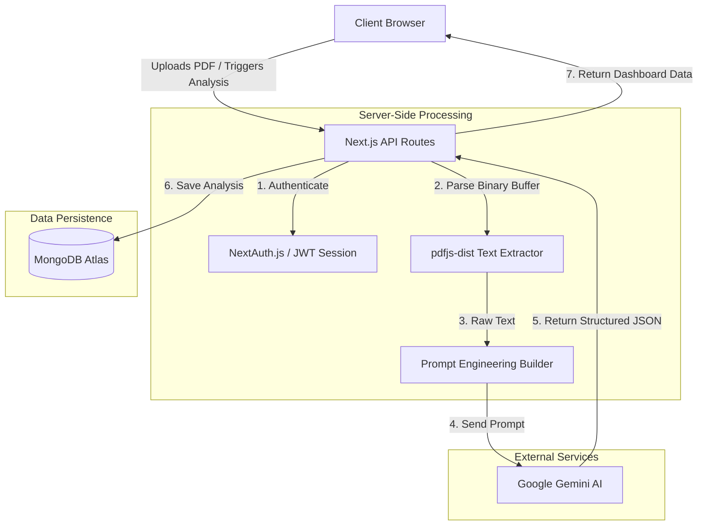

<div align="center">
  
# 🚀 CareerPilot AI
**Your Intelligent Career Mentor & Placement Readiness Platform**

[](https://nextjs.org/)
[](https://www.mongodb.com/)
[](https://ai.google.dev/)
[](https://tailwindcss.com/)
[](https://next-auth.js.org/)

**[Live Deployment Placeholder — Insert URL Here]**

</div>

---

## 🌟 Overview

**CareerPilot AI** is a comprehensive, AI-powered career intelligence platform built specifically for college students and fresh graduates. Navigating the journey from academia to industry can be overwhelming. CareerPilot bridges this gap by evaluating user profiles, predicting placement readiness, and providing hyper-personalized, actionable roadmaps.

Unlike generic advice platforms, CareerPilot AI uses advanced generative AI (Google Gemini) to deeply analyze unstructured data (like PDF resumes) and turn it into structured, quantifiable insights.

---

## ✨ Core Features

*   📄 **AI Resume Parsing & Analysis:** Upload a PDF resume and let our engine instantly extract and categorize your education, skills, projects, and experiences without manual data entry.
*   📊 **Career Score Dashboard:** Get a holistic "Placement Readiness Score" based on a rigorous evaluation of your skills, project quality, and industry alignment.
*   🎯 **Skill Gap Identification:** The AI compares your current skillset against industry standards for your target role and highlights exactly what you are missing.
*   🗺️ **Personalized Learning Roadmaps:** Generates week-by-week, actionable learning paths with specific milestones and resource recommendations to bridge your skill gaps.
*   🤖 **ATS Review:** Evaluates your resume through the lens of an Applicant Tracking System, giving you a compatibility score and actionable keyword suggestions.
*   🎤 **Interview Preparation:** Simulates role-specific interview scenarios, generating technical and behavioral questions tailored specifically to your resume and target role.

---

## 🏗️ Architecture & Technology Stack

CareerPilot AI is built on a modern, serverless-first stack designed for extreme speed, scalability, and developer experience.

### **Frontend Layer**
*   **Next.js 16 (App Router):** Leverages React Server Components (RSC) for maximum performance and minimal client-side JavaScript.
*   **Tailwind CSS:** For rapid, utility-first styling.
*   **Shadcn/ui:** Accessible, customizable, and beautifully designed unstyled components.
*   **Framer Motion:** For fluid, micro-interaction animations that create a premium, dynamic feel.
*   **Lucide Icons:** Clean, consistent iconography.

### **Backend Layer (Next.js API Routes)**
*   **Serverless Handlers:** `force-dynamic` API routes to handle authentication, file processing, and AI generation.
*   **PDF-JS Dist:** Custom Node.js implementation of Mozilla's PDF reader to accurately extract text from raw binary PDF buffers without relying on browser DOM APIs.

### **Data & AI Layer**
*   **Google Gemini API (`gemini-flash-lite-latest`):** The core intelligence engine. We use highly engineered structured prompts to enforce that the AI **only returns validated JSON schemas**, allowing the frontend to confidently render complex dashboards.
*   **MongoDB (Mongoose):** Flexible document database to store complex, nested AI analysis results (roadmaps, scores, project details) per user.
*   **NextAuth.js (Auth.js v5):** Robust, secure authentication supporting both Google OAuth and standard Email/Password credentials with Bcrypt hashing.

---

## 📐 System Architecture Flow



---

## 🚀 Getting Started (Local Development)

### 1. Prerequisites
*   Node.js (v18 or higher)
*   MongoDB URI (Local or Atlas)
*   Google Gemini API Key (Generate one at [Google AI Studio](https://aistudio.google.com/))
*   Google OAuth Credentials (Optional, for Google Login)

### 2. Clone the Repository
```bash
git clone <your-repo-url>
cd careerpilot-ai
```

### 3. Install Dependencies
```bash
npm install
```

### 4. Environment Variables
Create a `.env.local` file in the root directory and populate it with the following keys:

```env
# MongoDB Database
MONGODB_URI="mongodb+srv://<user>:<password>@cluster.mongodb.net/careerpilot"

# NextAuth Configuration
NEXTAUTH_URL="http://localhost:3000"
NEXTAUTH_SECRET="generate-a-random-32-char-string-here"

# Google Gemini AI Key
GEMINI_API_KEY="your-gemini-api-key"

# Google OAuth (Optional)
GOOGLE_CLIENT_ID="your-google-client-id"
GOOGLE_CLIENT_SECRET="your-google-client-secret"
```

### 5. Run the Development Server
```bash
npm run dev
```

Open [http://localhost:3000](http://localhost:3000) in your browser.

---

## 🎨 Design Philosophy
The UI/UX is heavily inspired by modern developer tools (Vercel, Linear). It utilizes dark mode natively, with soft pastel accents, glassmorphism (`backdrop-blur`), and subtle hover micro-animations to create an interface that feels highly premium, responsive, and alive.

---

<div align="center">
  <i>Built with ❤️ for students navigating their career paths.</i>
</div>
